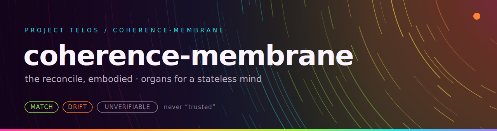

<p align="center"></p>

**The reconcile, embodied: externalized organs for a stateless mind.**


[](LICENSE)

[](https://github.com/HarperZ9/coherence-membrane/actions/workflows/ci.yml)

[](https://harperz9.github.io)

Coherence Membrane gives AI agents real eyes on local state: it perceives files, PNGs, screen captures, and context records into structured observations with exact hashes, dimensions, and perceptual fingerprints. Live screen capture goes straight through the OS compositor via stdlib `ctypes`, so it works across D3D, Vulkan, OpenGL, Metal, and software renderers with zero third-party dependencies. Baseline comparison returns a closed MATCH / DRIFT / UNVERIFIABLE verdict that never silently matches on difference, and it composes with a write-gate through a shared JSON shape. Every observation is receipt-shaped and re-derivable, so an agent can re-check what it saw.

## What it can do

- **Native screen capture with no graphics stack.** `grab_png` / `grab_raw` ask the OS compositor for the pixels it already has, through `ctypes` alone. No Pillow, no OpenCV, no per-renderer shim. The raw path skips PNG encoding entirely and computes the perceptual hash straight from BGRA bytes, bit-identical to the encoded path.
- **An always-on perception loop that stays cheap.** `run_continuity` hashes every frame for identity and only pays for a full decode and perceptual hash when something actually changed. A `ResourceBudget` caps the expensive work; a throttled change is reported `UNVERIFIABLE("throttled")`, never dropped.
- **16 self-proving perception organs.** Sight (PNG identity, dimensions, dHash), hearing (WAV loudness envelope), structured data (canonical JSON identity), captions, per-tile region drift, ASCII and braille glyph views a text model can read in context, marching-squares contour vectors, OKLab palette extraction, and raw frames. Every organ ships a `selftest()` that re-derives its own claims and can fail.
- **Six deductive verifier organs.** Propositional validity, quantity and unit arithmetic, distribution checks, linear arithmetic, graph claims (reachability, bottleneck, closure), and cross-checking between independent observations. The model proposes a claim; a deterministic oracle returns a certificate it cannot talk past.
- **Baseline memory on a three-rung ladder.** Pin an authorized observation, then check later ones: byte identity, then canonical (normal-form) identity, then perceptual distance. A reformatted-but-equivalent JSON document is a MATCH; a changed value is a DRIFT. Persists across runs with `save`/`load`.
- **The agent loop: make, look, compare, adjust.** `AgentLoop` lets an agent iterate against a `Goal` with advisory convergence, then routes the one consequential commit through a write-gate against the authorized baseline: allow, deny, or needs-human, fail-closed.
- **Tamper-evident provenance.** `ProvenanceGraph` is a hash-chained DAG of observations, actions, and gate decisions; altering any surviving node or edge breaks the binding of everything downstream. `WitnessReceipt` gives each observation an anchor the operator can pin or sign out-of-band.
- **Multimodal and temporal composition.** `perceive_composite` witnesses a frame, its audio, and its data as one instant with per-modality drift; `trace_events` turns a continuity stream into drift episodes with peak distance and settle time.
- **Verified code compression.** `python -m coherence_membrane distill` accepts a smaller candidate for a source file only when the declared criterion (syntax, public API, optionally tests) survives. Deterministic graders check; no model in the checking step.
- **Re-derivability, demonstrated.** A frozen conformance corpus (`conformance/vectors.json`, 16 cases) is re-derived value-for-value by two implementations that share no code: the Python reference and a Node.js core (`impl/js/`). JSON Schemas in `schemas/` pin the wire shapes.
- **Machine-checked safety laws.** `lattice.py` proves by exhaustive enumeration, on every `pytest` run, that each adjudicator stays inside its closed verdict set, reaches an affirmative verdict only on positive evidence, and that composing drift verdicts can never launder a worse set into a better one.

Zero runtime dependencies. The entire trust path is the Python standard library.

## Install

```bash
git clone https://github.com/HarperZ9/coherence-membrane
cd coherence-membrane
python -m pip install -e ".[test]"
```

Python 3.10+. Not yet on PyPI; this is a 0.1.0 alpha installed from source.

## Quickstart

```bash
python -m coherence_membrane selftest             # every organ proves itself; exits non-zero on any failure
python -m coherence_membrane capture shot.png     # one native screen grab
#   {"captured": "shot.png", "width": 2560, "height": 1440, "bytes": 108369}
python -m coherence_membrane watch 30 --raw       # always-on perception, encode-free fast path
python -m coherence_membrane perceive shot.png    # full observation JSON: hashes, dimensions, status
python -m pytest                                  # 914 passed, 3 skipped
python conformance/run.py                         # {"cases": 16, "passed": 16, "failed": 0, ...}
node impl/js/run.js                               # {"impl":"js","cases":16,"passed":16,"failed":0}
```

`capture` and `watch` read the composited display output. Use them only on surfaces you own or are authorized to inspect.

## A worked example

Perceive an artifact, pin it as the authorized baseline, and detect drift later. The same ladder covers images, audio, JSON, and captions.

```python
from coherence_membrane import perceive, Baseline, StructuredDataOrgan

snap = perceive(["frame.png"])                # inert: reads, never writes
obs = snap.observations[0]
obs.data["identity_sha256"]                   # exact, full-width, re-derivable
obs.data["width"], obs.data["height"]         # witnessed dimensions
obs.data["perceptual_hash"]                   # 64-bit dHash of the decoded pixels

b = Baseline()
b.pin(obs)                                    # the operator authorizes this state
b.check(perceive(["frame.png"]).observations[0]).verdict   # MATCH | DRIFT | UNVERIFIABLE
b.save("baseline.json")                       # drift is tracked across runs

# The canonical rung: reformatting is not drift, a changed value is.
organ = StructuredDataOrgan()
b2 = Baseline(); b2.pin(organ.observe(b'{"a": 1, "b": 2}')[0])
b2.check(organ.observe(b'{ "b": 2, "a": 1 }')[0]).verdict   # MATCH  (reformatted)
b2.check(organ.observe(b'{"a": 1, "b": 3}')[0]).verdict     # DRIFT  (value changed)
```

Deductive verification works the same way: observe a claim, get a certificate.

```python
from coherence_membrane import PropositionalVerifierOrgan
from coherence_membrane.propositional import Var, And, Implies

A, B = Var("A"), Var("B")
obs = PropositionalVerifierOrgan().observe(Implies(And(A, Implies(A, B)), B))[0]
obs.data["verdict"]   # "verified"  (modus ponens holds; an undecidable claim is UNVERIFIABLE, never guessed)
```

And every observation can carry a receipt with an operator-pinned anchor:

```python
from coherence_membrane import emit_receipt, verify_receipt
receipt = emit_receipt(obs)
anchor = receipt.anchor()                                # pin or sign this out-of-band
verify_receipt(receipt, pinned_anchor=anchor).verdict    # VALID
verify_receipt(receipt).verdict                          # UNVERIFIABLE (no anchor: honest)
```

## Live capture and the continuity loop

```python
from coherence_membrane import RawScreenCaptureSource, run_continuity, ResourceBudget

src = RawScreenCaptureSource(region=(0, 0, 1280, 720))   # raw BGRA, no per-frame encode
for event in run_continuity(src, budget=ResourceBudget(min_interval_s=0.1), max_frames=600):
    event.verdict     # MATCH (cheap identity hash) / DRIFT / UNVERIFIABLE
    event.distance    # perceptual distance on a real visual change
```

| Platform | Backend | Status |
| --- | --- | --- |
| Windows | GDI (`BitBlt` + `GetDIBits`) | validated live |
| macOS | CoreGraphics (`CGDisplayCreateImageForRect`) | implemented to the API, unvalidated |
| Linux / X11 | Xlib (`XGetImage`) | implemented to the API, unvalidated |

`LiveMembrane` ties capture, baseline memory, and consequence mediation into one object: perception is continuous and free, and only consequential actions (`publish`, `export`, `overwrite`, `spend`, `delete`, `send`, `deploy`) route to a gate. The operator can widen or narrow that set with `ConsequenceScope`.

## Command line

| Command | What it does |
| --- | --- |
| `python -m coherence_membrane selftest` | Run every organ's self-derivation checks; non-zero exit on any failure |
| `python -m coherence_membrane perceive <path>...` | Emit observation JSON for one or more artifacts |
| `python -m coherence_membrane capture <out.png>` | One native screen grab to a PNG |
| `python -m coherence_membrane watch [frames] [--raw]` | Continuity loop over live capture, one JSON event per frame |
| `python -m coherence_membrane distill --code --original <f> --candidate <f> [--tests <f>]` | Accept a compressed rewrite only if the criterion survives |

## The two gates

| Gate | Repo | Question it answers |
| --- | --- | --- |
| Read-gate (this repo) | `coherence-membrane` | What is actually there? Perceive real artifacts into witnessed observations. |
| Write-gate | [`proof-surface`](https://github.com/HarperZ9/proof-surface) | May this action proceed, given that state? Default-deny, advisory. |

They are deliberately separate repos that compose through a shared observation and receipt JSON shape, not through a dependency. A read-gate is useful to specs that never act; a write-gate is useful to agents with no eyes.

## Design discipline

- **Inert.** Organs read and report. They never mutate the artifact or the process that produced it; a test asserts observing a file leaves its bytes unchanged.
- **Advisory, never authority.** There is no TRUSTED or APPROVED status. The organ reports; a host re-derives and adjudicates.
- **Fail-closed.** An unreadable file, a malformed PNG, an undecidable claim, or a missing modality yields an unverified observation or UNVERIFIABLE, never a crash and never a fabricated verdict.
- **Selftest or net-negative.** An unverified membrane is worse than none, because it launders falsehood with ground-truth authority. Every organ can prove itself, or the CLI exits non-zero.

## Honest limits

- SHA-256 and dHash here are keyless self-consistency: re-derivable integrity, not tamper-evidence against an adversary who recomputes them. Anti-forgery needs the external anchor (a pinned or signed digest).
- A dHash is a coarse 64-bit fingerprint of low-frequency structure, not semantic understanding. Distance is advisory evidence.
- Capture reads the composited display output the operator can already see. It does not inject into, hook, or read another process's memory.
- The JS core's canonical JSON deliberately throws on non-safe-integer numbers rather than silently diverging from Python float semantics.
- This is a 0.1.0 alpha. APIs can still move, and non-Windows capture backends are unvalidated.

## Documentation

- [docs/INTRODUCTION.md](docs/INTRODUCTION.md): what it is, core concepts, and a first-ten-minutes walkthrough
- [USAGE.md](USAGE.md): command examples and the public boundary
- [ROADMAP.md](ROADMAP.md): where it goes next, with honest validation flags
- [CHANGELOG.md](CHANGELOG.md) and [AGENTS.md](AGENTS.md): delivery status and the repo operating boundary
- Peers: [proof-surface](https://github.com/HarperZ9/proof-surface) (the write-gate), [emet](https://github.com/HarperZ9/emet) (frozen verification vectors), and the wider [toolkit](https://harperz9.github.io)

## Verification

Everything above is re-derivable rather than asserted: 914 tests pass (3 skipped) with the lattice proofs run on every `pytest`, all 16 organs pass selftest, and two independent implementations re-derive the same 16-case conformance corpus value-for-value. If a claim in this README cannot be reproduced from the repo, that is a bug; please open an issue.

## License

MIT.

---
**Zain Dana Harper**, small tools with explicit edges.
[Portfolio](https://harperz9.github.io) · [HarperZ9](https://github.com/HarperZ9)
<sub>Built with Claude Code; reviewed, tested, and owned by me.</sub>
