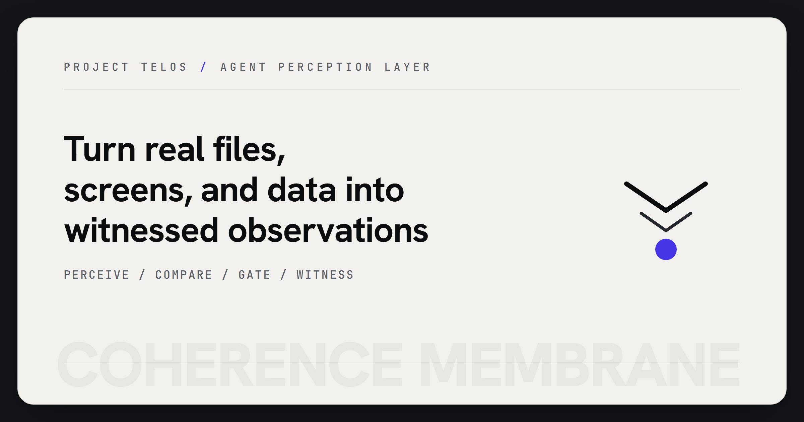

# Coherence Membrane



> Give AI agents inspectable observations of files, images, screens, and context.

Coherence Membrane is a Python perception layer for agent workflows. It turns
bounded local artifacts into observations with hashes, dimensions, drift checks,
and receipt-shaped data an agent can reason from instead of guessing.

## Why it matters

Agents make better decisions when they can inspect real state. This repo gives
developers a local way to observe images, files, screen captures, and context
records before another tool decides what action is allowed.

## Try it

```bash
python -m pip install -e ".[test]"
python -m coherence_membrane selftest
python -m pytest
```

## What to test first

- Perceive a small PNG and inspect the emitted hashes and dimensions.
- Compare a baseline and current artifact for `MATCH`, `DRIFT`, or `UNVERIFIABLE`.
- Run the tests before changing observation or drift behavior.

## Current status

Alpha Python package with stdlib-first perception paths, CLI commands, tests, and
integration points for proof-surface style gates.

## Existing technical notes

> An inert, host-adjudicated perception membrane for inspectable model context.

[](LICENSE)


[](https://github.com/HarperZ9/coherence-membrane/actions/workflows/ci.yml)

[](https://harperz9.github.io)

A model's one structural disability is **state-blindness**: it reasons on its prior
and on source text, not on what actually happened. When it says "this frame renders
correctly" or "this file contains X," that is a *guess about runtime state dressed as
a fact*. The membrane's job is to replace the guess with a **witnessed, re-derivable
observation** the model can ground on -- so it reasons on observed inputs and measured
outputs instead of simulating the world in its head.

The same grounding is the safety and the capability. A model that perceives true,
re-derivable state can't act on a hallucination (safety) **and** can finally close the
make → look → compare → adjust loop it was always blind in (capability). That dual use
-- in the good sense -- is the whole target.

## The two gates

| Gate | Repo | Question it answers |
| --- | --- | --- |
| **Read-gate** (this repo) | `coherence-membrane` | "What is *actually* there?" -- perceive real artifacts into witnessed Observations. |
| **Write-gate** | `proof-surface` (`pre_execution_gate`) | "May this action proceed, given that state?" -- default-deny, advisory. |

They are deliberately **separate repos**: a read-gate is useful to specs that never
act; a write-gate is useful to agents with no eyes. They compose through the shared
observation/receipt JSON shape, not through a dependency.

## What it does (increment 1)

A stdlib-only PNG perception path:

```python
from coherence_membrane import perceive, VisualArtifactOrgan, compare_drift

snap = perceive(["frame.png"])              # inert: reads, never writes
obs = snap.observations[0]
obs.data["identity_sha256"]                 # exact, full-width, re-derivable
obs.data["width"], obs.data["height"]       # witnessed dimensions
obs.data["perceptual_hash"]                 # 64-bit dHash of the decoded pixels
```

Drift against a baseline, as a closed lattice (mirroring EMET):

```python
verdict = compare_drift(baseline_sha, current_sha, baseline_phash, current_phash)
verdict.verdict   # MATCH | DRIFT | UNVERIFIABLE   (never a silent match on difference)
```

The perceived state then flows out through the write-gate:

```python
from coherence_membrane import build_gate_request, decide
req = build_gate_request(action_kind="render_read", target="frame.png",
                         authorization=receipt, drift=verdict)
decide(req)   # -> proof-surface GateDecision (allow/deny/needs-human), or
              #    needs-human if the write-gate isn't installed (fail-closed)
```

A `DriftVerdict`'s `MATCH/DRIFT/UNVERIFIABLE` *is* the gate's `witness_verdict`
lattice, so perceived visual drift flows straight into the gate's state check.

## Live capture (increment 2) -- native, universal, no shims

The architecture for capturing live frames is **dependency inversion: don't hook
the world, capture what it already composited.** Every renderer -- D3D11, D3D12,
Vulkan, OpenGL, Metal, software -- composites to the display. Capturing *there* is
agnostic to all of them by construction: the membrane never imports a graphics
API, never tracks a D3D version, and needs no producer-side shim. It asks the OS
for the pixels the OS already has, through the OS's own API via `ctypes` (stdlib --
no third-party package).

| Platform | Backend | Status |
| --- | --- | --- |
| Windows | GDI (`BitBlt` + `GetDIBits`) | **validated live** |
| macOS | CoreGraphics (`CGDisplayCreateImageForRect`) | implemented to the API; validate on-platform |
| Linux / X11 | Xlib (`XGetImage`) | implemented to the API; validate on-platform |

```bash
python -m coherence_membrane capture frame.png   # one native grab of the screen
python -m coherence_membrane watch 30             # always-on perception, 30 frames
```

```python
from coherence_membrane import ScreenCaptureSource, ResourceBudget, run_continuity
src = ScreenCaptureSource(region=(0, 0, 1280, 720))   # any owned/authorised surface
for event in run_continuity(src, budget=ResourceBudget(min_interval_s=0.2), max_frames=300):
    event.verdict     # MATCH (cheap) / DRIFT / UNVERIFIABLE (throttled)
    event.distance    # perceptual distance on a real visual change
```

**Always-on without being over-consumptive.** The continuity loop is
*change-proportional*: a cheap identity hash runs every tick; only a real change
escalates to the full decode + perceptual hash. A `ResourceBudget` caps the
expensive work and paces the cadence; once spent, a changed frame is reported
`UNVERIFIABLE("throttled")` -- never silently dropped.

**Mediate consequence, not activity.** The loop only *perceives*; it never gates.
Acting goes through the write-gate, and only for consequential actions:

```python
from coherence_membrane import creative_profile
scope = creative_profile()
scope.requires_gate("publish")   # True  -- consequential, gate it
scope.requires_gate("draw")      # False -- reversible/local, flows free
```

So creative and gamedev flow is frictionless by construction: perception is
continuous and free; only `publish`/`export`/`overwrite`/`spend`/`delete`/`send`/
`deploy` touch the gate, and the operator can widen or narrow that set.

## A second sense, and baseline memory (increment 3)

Perception is not only sight. The same inert observe→witness contract extends to
**hearing**: `AudioArtifactOrgan` perceives a WAV (stdlib `wave`, no third-party
audio stack) -- identity, format, and a 64-bit perceptual fingerprint of the
loudness envelope -- and fails closed to identity-only on anything it can't decode.

```python
from coherence_membrane import AudioArtifactOrgan, all_organs
AudioArtifactOrgan().observe("clip.wav")[0].data["perceptual_audio_hash"]
```

**Baseline memory** turns frame-to-frame drift into accountability over time:
pin an authorized observation, then check later observations against it. It is
modality-agnostic -- one baseline covers frames and sounds alike -- and returns the
same `MATCH` / `DRIFT` / `UNVERIFIABLE` lattice.

```python
from coherence_membrane import Baseline
b = Baseline(); b.pin(authorized_observation)   # the operator authorises a state
b.check(later_observation).verdict              # MATCH | DRIFT | UNVERIFIABLE
b.save("baseline.json")                          # drift is tracked across runs
```

## The living loop (increment 4)

`LiveMembrane` ties it together into one operator-configured object: it perceives
continuously, remembers an authorized baseline, and mediates **only consequence**.
It adds no authority and removes no check -- every guarantee still lives in the
parts it composes.

```python
from coherence_membrane import LiveMembrane, ScreenCaptureSource
m = LiveMembrane()                                   # defaults: creative profile
for event in m.perceive(ScreenCaptureSource(), max_frames=300):
    ...                                              # free, continuous perception
m.authorize(some_observation)                        # operator pins the baseline
m.propose("draw", "canvas").decision                 # "allow" -- reversible, un-gated
m.propose("publish", "site", authorization=receipt)  # routed to the write-gate
```

## The raw-frame fast path (increment 5) -- high-rate, encode-free

`ScreenCaptureSource` PNG-encodes every grab so each frame is witnessable on
disk. At high capture rates that encode is pure overhead -- the OS already handed
over raw pixels. `RawScreenCaptureSource` skips it: each frame carries the raw
BGRA bytes plus geometry, the continuity loop hashes those bytes for identity
every tick, and **only a real change** pays the perceptual hash -- computed
directly from the raw pixels (`RawFrameOrgan`), with no PNG encode and no decode,
ever.

```python
from coherence_membrane import RawScreenCaptureSource, run_continuity, ResourceBudget
src = RawScreenCaptureSource(region=(0, 0, 1280, 720))   # raw BGRA, no per-frame encode
for event in run_continuity(src, budget=ResourceBudget(min_interval_s=0.1), max_frames=600):
    event.verdict     # MATCH (cheap identity hash) / DRIFT / UNVERIFIABLE
    event.distance    # perceptual distance on a real change -- from raw pixels
# The loop selects RawFrameOrgan automatically for raw frames; no organ to pass.
```

The load-bearing guarantee, proven in the organ's selftest: the raw fast path
yields the **bit-identical** perceptual hash to the encode→decode path for the
same pixels. It changes the cost, never the answer.

```bash
python -m coherence_membrane watch 60 --raw   # always-on perception, fast path
```

| Path | Per-frame work (unchanged frame) | Per-frame work (changed frame) |
| --- | --- | --- |
| `ScreenCaptureSource` (PNG) | capture + convert + **zlib encode** + identity hash | + decode + perceptual hash |
| `RawScreenCaptureSource` (raw) | capture + identity hash | + convert + perceptual hash (**no encode/decode**) |

Illustrative single-run figures (one Windows machine, 640×480 region, median of
40 grabs): `grab_raw` ≈ 8 ms vs `grab_png` ≈ 20 ms per grab -- and unchanged
frames skip all perceptual work entirely. Re-derive your own with
`python scripts/bench_raw_vs_png.py`; the point measurement is reproducible
rather than asserted.

## A third sense, and canonical drift (increment 6)

Sight and hearing perceive pixels and sound. `StructuredDataOrgan` perceives
**data** -- a JSON document the operator owns or has authorised (stdlib `json`,
no third-party parser). It witnesses two identities: the raw bytes, and a
**canonical** identity -- the digest of the document re-serialised in a normal
form (sorted keys, no insignificant whitespace).

```python
from coherence_membrane import StructuredDataOrgan
obs = StructuredDataOrgan().observe(b'{"b": 2, "a": 1}')[0]
obs.data["identity_sha256"]    # the exact bytes
obs.data["canonical_sha256"]   # the document's normal form, hashed
```

Why two hashes: for an image, byte drift *is* the change. For data it is too
sensitive -- reformatting or reordering keys flips the raw identity while the
document is unchanged. So **baseline memory now checks on a three-rung ladder**:
byte identity → canonical (normal-form) identity → perceptual distance. A
reformatted-but-equivalent document is a `MATCH`; a changed value is a real
`DRIFT`; array order stays significant because it is meaningful.

```python
from coherence_membrane import Baseline
b = Baseline(); b.pin(StructuredDataOrgan().observe(b'{"a": 1, "b": 2}')[0])
b.check(StructuredDataOrgan().observe(b'{ "b": 2, "a": 1 }')[0]).verdict   # MATCH (reformatted)
b.check(StructuredDataOrgan().observe(b'{"a": 1, "b": 3}')[0]).verdict     # DRIFT (value changed)
```

This is **structural** canonicalisation (key order + whitespace + escaping), not
an understanding of content: canonical-equal is a sufficient-but-not-necessary
proxy for "the same data" -- equal canonical forms are genuinely equivalent, but
values that *mean* the same can still differ canonically. It normalises key order
and whitespace and escapes non-ASCII, but does **not** normalise numeric spelling
(`1` vs `1.0`) or representation (`1e3` vs `1000`), and it inherits IEEE-754 float
limits -- extreme magnitudes can round (e.g. `1e-400` → `0.0`), so the canonical
form reflects the *parsed* float, which may not equal the source literal.
`-0.0` and `0.0` differ; duplicate keys collapse to the last value (RFC-8259
parse). A value with no canonical form (`NaN`/`Infinity`) fails closed to
identity-only -- never a fabricated canonical hash. Canonicalisation runs entirely
in memory with no size cap (peak RAM is a small multiple of the document size);
bound the artifact size upstream before observing untrusted input.

## The agent loop (increment 7) -- make → look → compare → adjust

A state-blind model *reasons* about whether its action worked; the agent loop lets
it *check*. The agent **makes** (produces an artifact), the membrane **looks**
(perceives the result) and **compares** it to the intended goal, and recommends
**adjust** or **converged** -- purely advisory iteration control, never gated. The
one consequential step, **committing** the result, routes through the write-gate,
measuring drift against the operator-**authorized** baseline (the baseline ladder:
byte identity → canonical → perceptual).

```python
from coherence_membrane import AgentLoop, Goal
loop = AgentLoop(Goal.from_observation(reference_obs, tolerance=4))
for proposal in loop.iterate(agent.make, max_iterations=10):  # agent makes; loop looks
    proposal.disposition         # "adjust" ... until "converged"
loop.authorize()                                 # operator approves the converged result
loop.commit("publish", "site/index.html", authorization=receipt).decision
#   "allow"        -- result matches the approved baseline, grant valid
#   "deny"         -- result drifted from what was approved (gate sees the DRIFT)
#   "needs-human"  -- committed with no look, or no authorized baseline (fail-closed)
```

Two comparisons, deliberately separate so nothing is laundered: the **goal +
tolerance** governs *when to stop iterating* (advisory, never touches the gate);
the **commit** measures the result against the *authorized* baseline (identical
bytes -- or, for structured data, a canonically-equivalent form), so a model can
never publish something that doesn't match what it set out to make without the
gate seeing exactly that. The membrane never makes and never actuates -- it
perceives, compares, and recommends; the operator/runtime commits.

## Finer eyes, an external anchor, and a contract (increment 8)

Three advances that deepen the read-gate's granularity, trust, and credibility.

**Region/element perception -- *where* it changed.** `RegionArtifactOrgan` emits
the same whole-image facts (so it still slots into baseline memory and the gate)
plus a row-major grid of per-tile dHashes; `compare_region_drift` localises a
change to the tiles that actually moved.

```python
from coherence_membrane import RegionArtifactOrgan, compare_region_drift
a = RegionArtifactOrgan(rows=4, cols=4).observe("before.png")[0]
b = RegionArtifactOrgan(rows=4, cols=4).observe("after.png")[0]
compare_region_drift(a.data["region_hashes"], b.data["region_hashes"], 4, 4).changed_regions
# -> [5]   the change is isolated to tile 5, not "the whole screen changed"
```

**Signed observation receipts -- the external anchor across the seam.** A bare
SHA-256 is keyless self-consistency, not tamper-evidence. A `WitnessReceipt` wraps
an observation's witnessed facts with a content hash (its `anchor`); the operator
pins that anchor out-of-band (and may sign it), and `verify_receipt` re-derives
and checks it -- a closed `VALID / DRIFT / UNVERIFIABLE` lattice, fail-closed.

```python
from coherence_membrane import emit_receipt, verify_receipt
receipt = emit_receipt(observation)
anchor = receipt.anchor()                         # operator pins / signs this
verify_receipt(receipt, pinned_anchor=anchor).verdict   # VALID
verify_receipt(receipt).verdict                          # UNVERIFIABLE (no anchor -- honest)
```

**Conformance vectors + a wire spec -- re-derivability made *demonstrable*.**
`conformance/vectors.json` is a frozen, hash-pinned corpus; `conformance/run.py`
re-derives every case through this implementation; `schemas/` holds JSON Schemas
for the `Observation` and `DriftVerdict` wire shapes. A second, independent
JavaScript implementation (`impl/js/`) now re-derives the **same** corpus -- so
re-derivability is **demonstrated, not asserted** (increment 9).

```bash
python conformance/run.py     # all cases re-derive; corpus hash pinned
```

## Re-derivability, demonstrated (increment 9)

A second implementation, in JavaScript (`impl/js/membrane.js`), sharing **no code**
with the Python reference (Node built-ins only -- `crypto`, `zlib`), independently
re-derives every value in `conformance/vectors.json`: SHA-256, PNG-decode + dHash,
the drift lattice, canonical-JSON, region drift, and the receipt anchor. The
Python suite runs the JS harness and checks the two agree **value-for-value**.

```bash
node impl/js/run.js     # {"impl":"js","cases":16,"passed":16,"failed":0}
```

This retires the honest caveat increment 8 shipped with: a witness two independent
implementations agree on -- across the **frozen contract corpus** -- is a *proof*,
not a claim. It is also the on-ramp for the JS-native worlds (editors, CI, Node
tooling) that need the inert read core without a Python runtime -- and deliberately
does **not** port native capture, which is OS-specific and unvalidatable off the
author's platform.

**Known fidelity boundary (honest).** The demonstration is over the corpus, not a
proof of total equivalence. The one place the two languages can't trivially agree
is numbers: a JSON float like `1.0` parses to the integer `1` in JS, and JS can't
reproduce Python's float repr. So the JS `canonical()` **throws** on any
non-safe-integer number rather than silently diverging -- floats and integers
beyond 2⁵³ are out of the JS core's contract (the corpus uses only safe integers).
Strings, bools, null, arrays, objects, PNG-decode + dHash, the drift/region
lattices, and receipt anchors agree exactly.

## Perceiving over time and across senses (increment 10)

**Temporal perception.** The continuity loop emits a flat per-tick stream;
`EventTrace` structures it into drift **episodes** -- when a change began, how far
it peaked, and when it settled -- plus the longest **dwell** (run of unchanged
ticks).

```python
from coherence_membrane import trace_events
trace = trace_events(continuity_events)          # any stream of verdicts
trace.episodes[0].peak_distance, trace.episodes[0].settled_at
trace.longest_dwell
```

So a model grounds "the canvas changed at t=3, peaked at distance 18, settled by
t=7" rather than only "tick 5 was DRIFT". An episode needs a real `DRIFT`;
`UNVERIFIABLE` keeps an open episode open (uncertain), never opens one alone.

**Multimodal composition.** `CompositeObservation` bundles several organs' observations
at one instant (a frame + its audio + the data behind them) into one witnessed
unit with a single composite identity; `compare_composite` reports drift **per
modality** and overall.

```python
from coherence_membrane import perceive_composite, compare_composite
now = perceive_composite([(eye, "frame.png"), (ear, "clip.wav")])
compare_composite(authorized, now).verdict        # DRIFT if ANY modality drifted
```

So "the scene changed but the audio held" is expressible. Same closed lattice,
fail-closed: `DRIFT` if any component drifted, else `UNVERIFIABLE` if any modality
is missing/uncomparable, else `MATCH` -- a missing modality is never a silent match.

## More senses: glyph view + captions (increment 11)

**ASCII perception -- perceptive state as compact, model-readable text.**
`AsciiViewOrgan` emits the usual identity + dHash (so it slots into baseline and
the gate) **plus** a tiny grid of glyphs -- a coarse luminance projection a text
model can read in context with no image decode, and a human can eyeball. It is the
dHash move with a *legible* output, which is what makes it cheap to store and to
ground on.

```python
from coherence_membrane import AsciiViewOrgan, compare_ascii_drift
obs = AsciiViewOrgan(cols=48).observe("frame.png")[0]
obs.data["ascii_view"]          # ['  ..::-==+*#%@', ...]  the witnessed glyph grid
obs.data["ascii_sha256"]        # a compact digest of the grid
compare_ascii_drift(before, after).changed_cells   # per-cell "where the glyphs moved"
```

Honest: it is luminance glyphs, advisory evidence -- **not** OCR or a semantic
summary. (The idea is [ASCILINE](https://github.com/YusufB5/ASCILINE)'s,
reimplemented natively -- stdlib only, nothing third-party in the trust path.)

**Captions -- the membrane reads what was said.** `CaptionOrgan` perceives a
subtitle/transcript line: raw-byte identity plus a **canonical** text identity
(Unicode NFC + collapsed whitespace), so it plugs into baseline memory's canonical
rung and a whitespace-different-but-same caption is a `MATCH`. Composed
per-timestamp with a frame organ (`perceive_composite`), the membrane witnesses
*what was on screen* **and** *what was said* as one instant.

```python
from coherence_membrane import CaptionOrgan, perceive_composite
moment = perceive_composite([(eye, "frame.png"), (CaptionOrgan(), caption_bytes)])
```

Same honesty as the structured organ: canonicalisation normalises Unicode form and
whitespace only -- not case, punctuation, or meaning. Non-UTF-8 fails closed.

## Causal provenance -- a tamper-evident record of the loop (increment 12)

`ProvenanceGraph` is a hash-chained DAG of what was perceived and done: nodes are
observations / actions / gate-decisions, edges are typed (`observed-after`,
`gated-by`, `caused-by`). Each node's **binding** is a SHA-256 over its content
plus its parents' bindings -- the write-gate's delegation-chain mechanism re-aimed
at perception -- so tampering any surviving node or its edges breaks that binding
and every one downstream. `verify()` re-derives the whole graph (order-independent):
`VALID` / `BROKEN` / `UNVERIFIABLE`.

```python
from coherence_membrane import ProvenanceGraph, CAUSED_BY
g = ProvenanceGraph()
g.add_observation("look", confirming_obs)                 # a confirming look
g.add("adjust", "action", "...", parents=["look"], edge_type=CAUSED_BY)
g.add("commit", "action", "...", parents=["adjust"], edge_type=CAUSED_BY)
anchor = g.manifest()                    # operator pins/signs this out-of-band
g.verify(pinned_manifest=anchor).verdict # VALID -- nothing tampered, nothing inserted
g.has_confirming_look_ancestor("commit") # True -- an asserted look is an ancestor of the publish
```

Honest about what it proves: the per-node chain proves no **surviving** node was
altered -- you can't silently rewrite a digest, re-parent a node, or drop an edge
without `verify()` catching it. It does **not** by itself catch **membership**
changes (inserting a fabricated leaf, deleting a childless node) -- `manifest()` is
the anchor that does, pinned out-of-band. It does **not** prove the causality is
real: a `caused-by` edge and "ancestor" relationship are *asserted* (there are no
timestamps). And keyless binding is self-consistency, not non-repudiable identity --
real anti-forgery needs that external anchor, the same boundary as the receipt and
the delegation chain.

## Formal lattice verification -- the safety claims, proven (increment 13)

Every adjudicator returns a verdict from a small **closed** set: drift is
`MATCH` / `DRIFT` / `UNVERIFIABLE`, a receipt `VALID` / `DRIFT` / `UNVERIFIABLE`,
a graph `VALID` / `BROKEN` / `UNVERIFIABLE`. The whole membrane's safety rests on
three claims the rest of the code only *asserted* in docstrings. `lattice.py`
turns them into machine-checked proofs. The carriers are finite (three elements
each), so exhaustive enumeration is a **complete** decision procedure -- every law
checked over every tuple, run on every `pytest`. For these finite, non-temporal
laws that is exactly what an explicit-state model checker (TLA+/TLC) does --
enumerate the whole space -- so the check lives in the test suite directly, with no
separate spec or toolchain to rot.

```python
from coherence_membrane import prove_all
assert all(p.ok for p in prove_all())   # or: python -m coherence_membrane.lattice
```

- **Closure** -- each adjudicator's verdict is *always* inside its declared set;
  no out-of-lattice value can escape `compare_drift`, `compare_composite`,
  `verify_receipt`, `verify()`, `Baseline.check`, `_assess`, or `trace_events`.
- **Fail-closed reachability** -- the affirmative **top** (`MATCH` / `VALID` /
  `CONVERGED`) is reachable **only** with positive, witnessed evidence: exact byte
  identity, a matching pinned anchor / a verifier, a fully-consistent graph, a
  within-tolerance look. Absence of evidence lands at `UNVERIFIABLE` /
  `INDETERMINATE`; contrary evidence at `DRIFT` / `BROKEN`. The default is never
  affirmative -- proven against the real functions, not asserted.
- **Monotonic attenuation** (for the *combined* drift lattice) -- combination is
  the lattice **meet**: commutative, associative, idempotent, with `MATCH` as its
  identity (a confirmed modality composes away) and `DRIFT` as its absorbing
  element (one confirmed change sinks the composite), and **monotone** (degrading
  any input never improves the result). `compare_composite` is proved *equal* to
  this meet over its reported components -- so composing observations can never
  launder a worse set into a better verdict. A missing, duplicated, or extra
  modality is a *theorem* away from a silent `MATCH`, not a comment.

The abstract laws are trivial for a three-element chain -- deliberately. The work,
and the regression value, is the **binding**: the executable proofs that the
implementations land in, refine, and aggregate exactly as these structures say.

## Design discipline (encoded, not asserted)

- **Inert.** Organs read and report. They never mutate the artifact, the process that
  produced it, or anything else. A test asserts observing a file leaves its bytes
  unchanged.
- **Advisory, never authority.** There is no `TRUSTED`/`APPROVED` status. The organ
  reports; a host re-derives and adjudicates.
- **Witnessed, not inferred.** Every observation carries the **full-width** SHA-256 of
  the bytes it saw (no truncation -- the digest is the trust anchor).
- **Selftest or net-negative.** Every organ ships a `selftest()` that re-derives its
  own claims from a known artifact and can fail. *An unverified membrane is worse than
  none -- it launders falsehood with ground-truth authority.* `python -m
  coherence_membrane selftest` exits non-zero if any organ can't prove itself.
- **Fail-closed.** An unreadable file or an unsupported/malformed PNG yields an
  `unverified` observation with no perceptual hash -- never a crash, never a fabricated
  hash.

## Honesty about what it is

- The SHA-256 and the dHash are **keyless self-consistency** -- re-derivable integrity,
  not non-repudiable identity and not tamper-evidence against an adversary who
  recomputes them. Anti-forgery needs an external anchor (a signed/pinned digest); the
  write-gate is where that belongs.
- A dHash is a coarse 64-bit fingerprint of low-frequency structure, **not** a semantic
  understanding of the image. Distance is advisory evidence.
- Capture reads the **composited display output** the operator can already see, via
  the OS's own screen API -- it does **not** inject into, hook, or read another
  process's memory, and it must be used only on surfaces the operator owns or has
  authorised. It is perception of the screen, not intrusion into a program.
- The **raw identity** (SHA-256 of BGRA bytes) is *not* equal to the **PNG identity**
  for the same pixels -- they are different byte streams. Only the *perceptual
  fingerprint* is comparable across the raw and PNG paths; a baseline pinned on raw
  frames matches raw frames, and one pinned on PNGs matches PNGs. This is stated,
  and tested, rather than glossed.

## Roadmap

- **Increment 1:** static-artifact perception -- PNG identity, dimensions, perceptual
  hash, drift; the inert organ + selftest contract; `perceive()`; the write-gate bridge.
- **Increment 2:** the agnostic frame-handoff contract; native universal capture of the
  composited output (Windows/macOS/Linux via `ctypes`, no shims); the
  change-proportional, self-throttling continuity loop; consequence-scope.
- **Increment 3:** a second sense (`AudioArtifactOrgan`) on the same contract;
  modality-agnostic baseline memory (drift against an authorized baseline, persisted).
- **Increment 4:** `LiveMembrane` -- the living loop as one configurable object
  (perceive + remember + mediate consequence).
- **Increment 5:** the raw-frame fast path -- `grab_raw` /
  `RawScreenCaptureSource` (encode-free native capture), `RawFrameOrgan`
  (perceptual hash straight from raw pixels), and `perceptual_hash_raw`; the
  continuity loop auto-selects the raw organ for raw frames. Bit-identical to the
  PNG path, proven by selftest; validated live on Windows.
- **Increment 6:** a third sense -- `StructuredDataOrgan` (JSON) with a
  canonical (normal-form) identity; baseline memory generalised to a three-rung
  ladder (byte identity → canonical identity → perceptual distance), so drift on
  structured data is measured on the document's normal form, not its raw bytes.
- **Increment 7:** the agent loop -- `AgentLoop` / `Goal` /
  `AdjustmentProposal`: make → look → compare → adjust as a real, grounded loop,
  with the one consequential commit routed through the write-gate against the
  authorized baseline (allow / deny / needs-human, fail-closed).
- **Increment 8:** finer eyes, an external anchor, and a contract --
  `RegionArtifactOrgan` + `compare_region_drift` (where it changed), `WitnessReceipt`
  + `verify_receipt` (a pinned/signed anchor across the read→write seam), and a
  hash-pinned conformance corpus + JSON-Schema wire spec (re-derivability made
  demonstrable -- a second implementation is what proves it).
- **Increment 9:** a second-language (JavaScript) reference core
  (`impl/js/`) that independently re-derives the conformance corpus --
  re-derivability **demonstrated**: two implementations sharing no code agree,
  value-for-value, on the frozen contract corpus (with an honest, fail-loud number
  boundary so they never silently diverge beyond it).
- **Increment 10:** perceiving over time and across senses -- `EventTrace`
  (drift episodes / settle-detection / dwell over the continuity stream) and
  `CompositeObservation` + `compare_composite` (one witnessed instant across
  modalities, with per-modality drift).
- **Increment 11:** more senses -- `AsciiViewOrgan` (compact, model-readable
  glyph view of a frame) and `CaptionOrgan` (subtitle/transcript text with a
  canonical identity), so perceptive state is cheap to store and "what was said"
  composes with "what was on screen".
- **Increment 12:** the causal/temporal provenance DAG -- `ProvenanceGraph`,
  a hash-chained, tamper-evident record of what was perceived and done. It shows a
  consequential action has a confirming look as an ancestor (reachability over
  attested edges, not a temporal or causal proof -- there are no timestamps).
- **Increment 13 (this):** formal lattice verification -- `lattice.py` proves the
  verdict sets are bounded lattices, that every adjudicator is closed under its
  set and reaches the affirmative top only on positive evidence (fail-closed), and
  that drift composition is exactly the lattice **meet** (monotonic attenuation:
  composition never amplifies trust). Machine-checked by exhaustion, run on every
  `pytest`; bound to the real functions, not asserted.
- **Next:** see [ROADMAP.md](ROADMAP.md) for the full plan.
  `[unvalidatable-here]`: macOS/Linux/Wayland capture validation (the author has
  Windows only -- those backends are implemented to the OS APIs but unvalidated).

## Install / test

```bash
pip install -e ".[test]"
python -m pytest          # 294 tests
python conformance/run.py                         # the read-gate wire contract (Python)
node   impl/js/run.js                             # the SAME contract, re-derived in JS
python -m coherence_membrane selftest             # every organ proves itself
python -m coherence_membrane capture frame.png    # native screen grab
python -m coherence_membrane watch 60 --raw       # always-on perception, fast path
```

## License

MIT.

---
**Zain Dana Harper** -- small tools with explicit edges.
[Portfolio](https://harperz9.github.io) · [HarperZ9](https://github.com/HarperZ9)
<sub>Built with Claude Code; reviewed, tested, and owned by me.</sub>

## For developers

Keep the public README, package metadata, and examples aligned with current behavior. Before opening a PR or pushing a release, run the local package verification path.

```bash
python -m pip install -e ".[test]"
python -m pytest
```

See [AGENTS.md](AGENTS.md) for the repo-specific operating boundary,
[USAGE.md](USAGE.md) for command examples, and [CHANGELOG.md](CHANGELOG.md) for
current delivery status.
